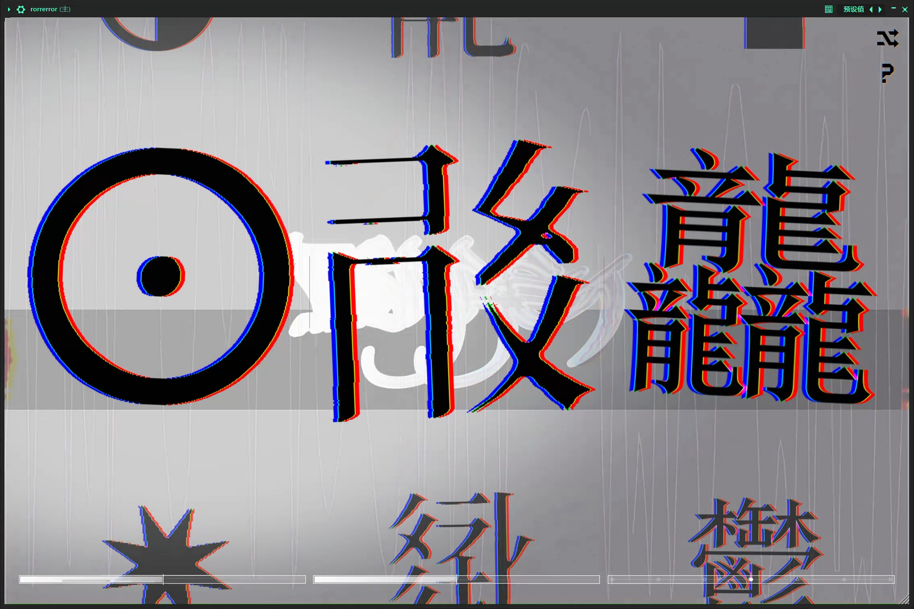
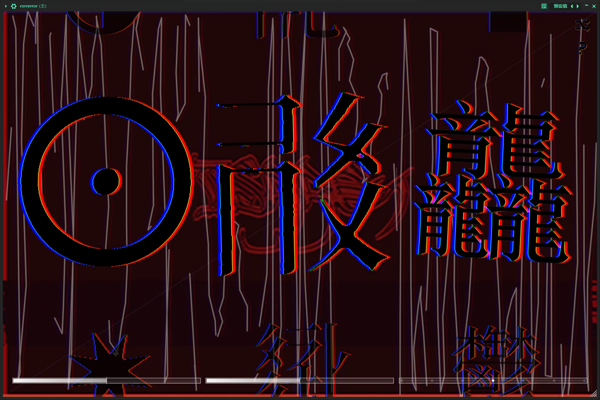

<h1 align="center">rorrerror</h1>

<p align="center"><strong>r̷̢̛̗o̸̧̟r̷̢̼r̶̨̙e̸̢̘r̷̢̹r̸̛̫o̷̧͎r̸̢̙</strong></p>

<p align="center">
  <em>文字恐怖 · 乱码 · 失真</em><br>
  <em>Text Horror · Mojibake · Distortion</em>
</p>

<p align="center">
  
  
  
</p>

<p align="center">
  <code>▒▒▒ D̷E̸C̶O̷D̶E̸ ̵F̷A̶I̸L̷E̶D̷ ▒▒▒</code><br>
  <code>锟斤拷锟斤拷 · 烫烫烫烫烫烫 · 屯屯屯屯屯屯</code>
</p>

---

## 概述 / Overview

**rorrerror** 对声音做的事，和乱码对文字做的事，是同一件事——把它变成一堆**无法辨认、令人不安的字符**。你认识每一个偏旁，却再也读不出它原本想说什么。

> **中文**：一款面向实验音乐 / 地下电子制作人的**破坏性失真与 Glitch 效果插件**。它的灵魂是 **文字恐怖（Text Horror）**——那些奇怪的、不该出现的字符：生僻字、错乱的编码、无法解码的乱码。它们没有被"撕裂"，而是**从来就不该被解读**。

> **English**: A destructive distortion & glitch effect for experimental / underground producers. Its soul is **text horror** — those strange characters that should never appear: rare glyphs, broken encodings, undecodable mojibake. They are not "torn"; they were never meant to be read.

> 分类 Category：Fx / Distortion / Glitch ｜ 插件代码 Plug-in Code：`Grdb` ｜ 厂商 Vendor：iisaacbeats.cn

---

## 预览 / Preview

<p align="center">
  
  
</p>

<p align="center">
  <code>左̸：̛还̶认̷得̸出̵几̶个̷字̸ ░ 右̸：̛已̶经̷全̸是̵乱̶码̷</code><br>
  <em>left: a few characters still legible — right: nothing but mojibake.</em>
</p>

---

## 创意灵感 / Inspiration

<blockquote>
<strong>文字恐怖 / Text Horror</strong>：不是被撕碎的字，而是那些**不该被解读、却仍然排列在屏幕上的字符**——生僻字、错乱的编码、被错误解码的乱码。

<p align="center">
<code>
龘 靐 齉 爨 癵 齾 䨻 龗 靁 麤 驫 鱻 爩 灪 鞷 䲜<br>
犇 羴 猋 毳 矗 赑 淼 焱 垚 鑫 掱 嚚 嚣 囡 孬 嫑 嘦 巭<br>
兲 亗 忈 氼 氽 氿 炛 甴 甽 臦 艸 芔 茻 叒 惢 歮 皕 畾 聶 轟 蠡 籲 虋 鼐 㐀 〇 丶 丿 灬<br>
锟斤拷锟斤拷锟斤拷锟斤拷 烫烫烫烫烫烫 屯屯屯屯 铪铪铪铪<br>
̷̢̛̗文̸̧̟字̷̢̼恐̶̨̙怖̸̢̘ ̷̢̹乱̸̛̫码̷̧͎
</code>
</p>

</blockquote>

它们看起来像是某种语言，却又什么都不是。插件界面里那些安静排列的字符，正是它对声音所做一切的视觉投影：当文字变成乱码，声音也随之失真。

> *They look like a language, but they say nothing. The characters sitting quietly on the interface are the visual projection of everything the plugin does to sound: as the text turns to mojibake, so does the audio.*

---

## 功能模块 / Modules

| 模块 / Module | 功能描述 / Description |
|------|---------|
| **削波 Clip** | **4 种输出削波**：软削波（tanh）/ 硬削波（±1 限幅）/ 折返削波（foldback）/ 非对称削波。切换带 20ms 交叉淡化。<br>*4 output clippers: tanh / hard clamp / foldback / asymmetric.* |
| **波形整形 Waveshaper** | **15 种波形整形**：锯齿 / 梯形量化 / 三角折叠 / 相位扭曲全波整流 / 折返 / 自调制量化 / 波折叠自FM / 环调金属 / 粗量化 bitcrush / 级联过驱 fuzz / 混沌波折叠 / 正弦波折叠 / 全波整流 / 交越死区 / Chebyshev 5次。<br>*15 waveshapers, from sawtooth & foldback to cascaded fuzz and chaotic sine-folding.* |
| **故障 Glitch** | **10 种节拍同步故障**：缓冲重复 / 消音 / 反向切片 / Sample&Hold / 随机切片跳读 / 颗粒重排 / 磁带停止 / 1-bit 降采样 / 比特翻转 / 扫频环调。<br>*10 beat-synced glitches, from stutter & reverse to bit-rot and swept ring-mod.* |
| **搓碟 Scratch** | 从 0.6s 环形缓冲中正放/倒放音频，拖动速度即播放速率。<br>*Plays the 0.6s ring buffer forward/backward; drag speed = playback rate.* |
| **随机 Random** | 全部参数滚动到随机组合 + 全链路倒带音效。<br>*Spin all parameters to a random combination with a tape-rewind effect.* |
| **响度均衡 Loudness** | 每种波形整形离线归一化增益 + 运行时动态补偿，切换不失响度。<br>*Per-mode normalization gain + runtime auto-trim.* |
| **节拍同步 Tempo-sync** | 故障周期锁定宿主 BPM/PPQ：持续 / 每 2·4·8·16·32 拍 / 永不。<br>*Glitch period locked to host BPM/PPQ: continuous / every 2·4·8·16·32 beats / never.* |

---

## 技术栈 / Tech Stack

| 项目 / Item | 版本 / Version |
|------|------|
| 语言 Language | C++23 |
| 框架 Framework | [JUCE](https://juce.com) 8.0.12（FetchContent 自动拉取） |
| 构建 Build | CMake ≥ 3.22 |
| 安装器 Installer | Inno Setup 6（Windows） |

---

## 构建 / Build

```bash
# 克隆仓库 Clone
git clone https://github.com/sweetorange1/rorrerror.git
cd rorrerror

# CMake 配置 & 构建（Release）
# 注意：构建目录必须命名为 cmake-build-release（打包脚本按此路径取产物）
# Note: build dir must be named cmake-build-release
cmake -B cmake-build-release -DCMAKE_BUILD_TYPE=Release
cmake --build cmake-build-release --config Release
```

构建成功后 VST3 会自动复制到 `%LOCALAPPDATA%\Programs\Common\VST3`（无需管理员权限）。
*On success the VST3 is copied to `%LOCALAPPDATA%\Programs\Common\VST3` (no admin rights needed).*

## 打包安装器 / Packaging

```bash
# 需要先安装 Inno Setup 6 / Requires Inno Setup 6
build_installer.bat
# 产物 Output：dist\rorrerror_Setup_1.2.0_x64.exe
```

安装器将 VST3 装入系统目录 `C:\Program Files\Common Files\VST3\iisaacbeats.cn`；若改选其他目录，安装完成后请在 DAW 中手动添加该目录并重新扫描插件。
*The installer places the VST3 into `C:\Program Files\Common Files\VST3\iisaacbeats.cn`; if you choose another folder, add it to your DAW and rescan.*

---

## 隐私说明 / Privacy

- **更新检查 Update check**：启动后异步请求 `iisaacbeats.cn` 一次（5s 超时，失败静默），仅在有新版本时弹窗提示。
  *Async check to `iisaacbeats.cn` on startup (5s timeout, silent on failure); prompts only when a new version exists.*
- **匿名遥测 Telemetry**：每日一次匿名的"界面打开"事件（无任何音频数据、无个人身份信息），客户端为随机 UUID。
  *Anonymous "ui opened" event once per day (no audio, no PII), random client UUID.*
- 停用遥测 Disable telemetry：启动前设置环境变量 `IISAAC_TELEMETRY_DISABLED=1`。
  *Set `IISAAC_TELEMETRY_DISABLED=1` before launch.*

---

## 许可 / License

本项目代码骨架基于 [The WolfSound](https://thewolfsound.com) 的 JUCE CMake 模板（MIT），业务代码版权归 iisaacbeats.cn 所有。
*The code skeleton is based on The WolfSound's JUCE CMake template (MIT); the DSP/UI/network code is © iisaacbeats.cn.*

第三方组件 Third-party：

| 组件 / Component | 许可 / License |
|------|------|
| JUCE 8 | GPL-3.0 / 商业双授权 GPL-3.0 / commercial dual |

---

<p align="center">
  <code>▚̷̢̛▚̸̧̟▚̷̛̗▚̸̨̘▚̷̢̹▚̸̛̫ 锟̶斤̷拷̸ 烫̷烫̸烫̷烫̸</code><br>
  <em>让声音变成无法被解读的乱码。</em><br>
  <em>Let the sound become unreadable mojibake.</em><br><br>
  &copy; 2024-2026 iisaacbeats.cn
</p>
